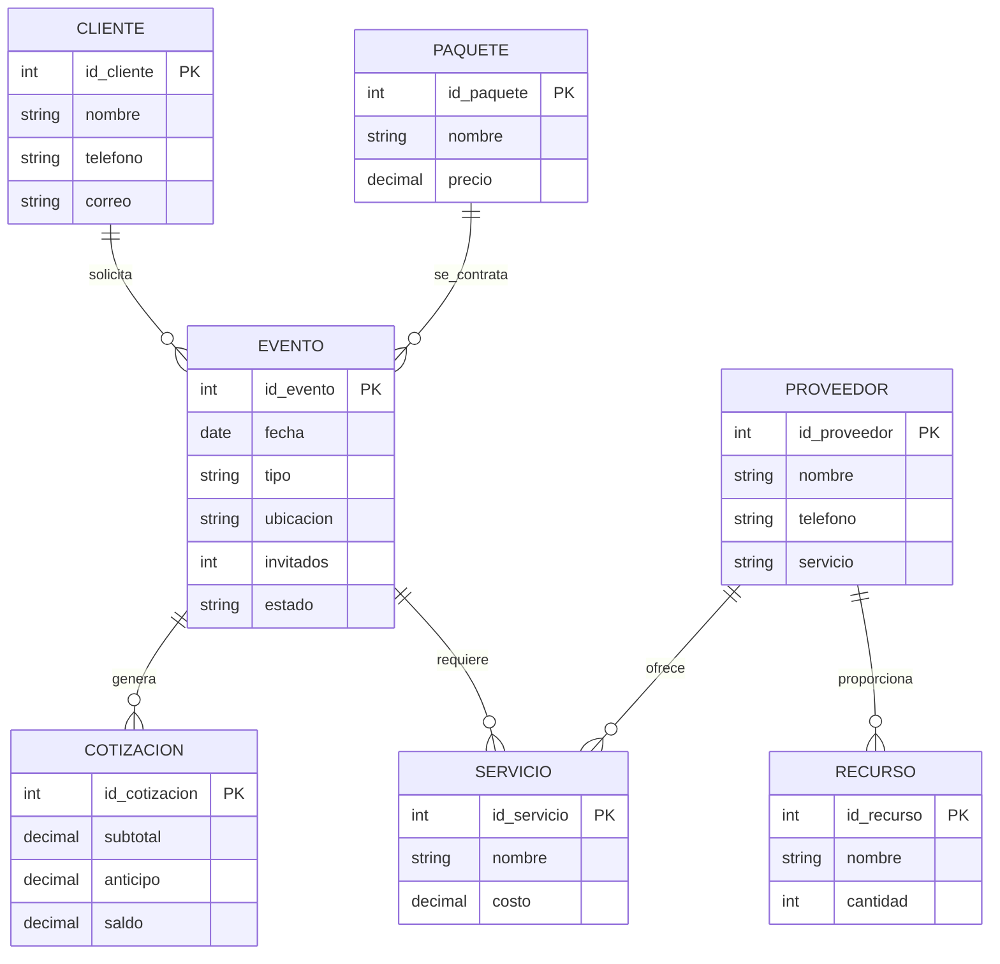

# Modelo Entidad-Relación - Momentos Especiales

```mermaid
erDiagram
    CLIENTE ||--o{ EVENTO : solicita
    PAQUETE ||--o{ EVENTO : se_contrata
    EVENTO ||--o{ COTIZACION : genera
    PROVEEDOR ||--o{ RECURSO : proporciona
    EVENTO ||--o{ SERVICIO : requiere
    PROVEEDOR ||--o{ SERVICIO : ofrece

    CLIENTE {
        int id_cliente PK
        string nombre
        string telefono
        string correo
    }
    EVENTO {
        int id_evento PK
        date fecha
        string tipo
        string ubicacion
        int invitados
        string estado
    }
    PAQUETE {
        int id_paquete PK
        string nombre
        decimal precio
    }
    COTIZACION {
        int id_cotizacion PK
        decimal subtotal
        decimal anticipo
        decimal saldo
    }
    PROVEEDOR {
        int id_proveedor PK
        string nombre
        string telefono
        string servicio
    }
    RECURSO {
        int id_recurso PK
        string nombre
        int cantidad
    }
    SERVICIO {
        int id_servicio PK
        string nombre
        decimal costo
    }
```
